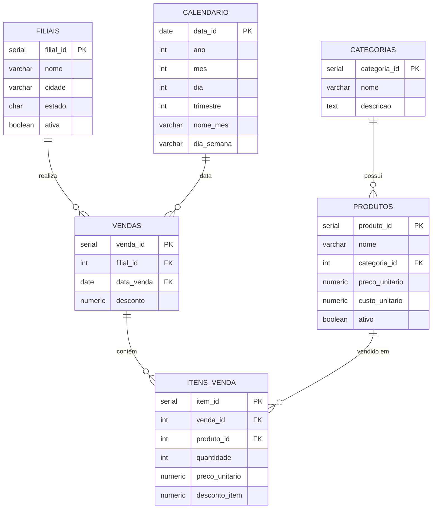

# Modelo Técnico do Banco de Dados — Rede Comercial Aurora

## Visão Geral

O banco de dados `aurora_db` foi projetado para armazenar e consultar dados comerciais da Rede Comercial Aurora. A estrutura permite responder às 5 perguntas de negócio obrigatórias e calcular os 8 indicadores definidos nos requisitos.

**SGBD:** PostgreSQL 16

---

## Diagrama de Relacionamentos (ER)

---

## Tabelas

### 1. `calendario`

| Campo | Tipo | Restrições | Descrição |
|-------|------|-----------|-----------|
| `data_id` | `DATE` | **PK** | Data completa (chave primária) |
| `ano` | `INTEGER` | NOT NULL | Ano |
| `mes` | `INTEGER` | NOT NULL, CHECK 1–12 | Mês |
| `dia` | `INTEGER` | NOT NULL, CHECK 1–31 | Dia |
| `trimestre` | `INTEGER` | NOT NULL, CHECK 1–4 | Trimestre |
| `nome_mes` | `VARCHAR(20)` | NOT NULL | Nome do mês por extenso |
| `dia_semana` | `VARCHAR(20)` | NOT NULL | Nome do dia da semana |

**Finalidade:** Dimensão de tempo que permite análise por período (mês, trimestre, ano). Facilita filtros temporais e agrupamentos nas consultas de indicadores.

**Chaves estrangeiras:** Nenhuma (tabela dimensão).

**Observações:** Populada com datas representativas de 2024. Pode ser expandida com mais datas conforme necessário.

---

### 2. `filiais`

| Campo | Tipo | Restrições | Descrição |
|-------|------|-----------|-----------|
| `filial_id` | `SERIAL` | **PK** | Identificador único da filial |
| `nome` | `VARCHAR(100)` | NOT NULL | Nome da filial |
| `cidade` | `VARCHAR(100)` | NOT NULL | Cidade |
| `estado` | `CHAR(2)` | NOT NULL | UF |
| `ativa` | `BOOLEAN` | NOT NULL, DEFAULT TRUE | Se a filial está ativa |

**Finalidade:** Cadastro das filiais da rede. Permite filtrar e agrupar vendas por filial para análise de receita e margem.

**Chaves estrangeiras:** Nenhuma.

**Relacionamentos:** Uma filial pode ter muitas vendas (1:N com `vendas`).

---

### 3. `categorias`

| Campo | Tipo | Restrições | Descrição |
|-------|------|-----------|-----------|
| `categoria_id` | `SERIAL` | **PK** | Identificador único |
| `nome` | `VARCHAR(100)` | NOT NULL, UNIQUE | Nome da categoria |
| `descricao` | `TEXT` | — | Descrição opcional |

**Finalidade:** Classificação dos produtos. Permite agrupar análises por categoria para responder quais categorias geram maior receita.

**Chaves estrangeiras:** Nenhuma.

**Relacionamentos:** Uma categoria pode ter muitos produtos (1:N com `produtos`).

---

### 4. `produtos`

| Campo | Tipo | Restrições | Descrição |
|-------|------|-----------|-----------|
| `produto_id` | `SERIAL` | **PK** | Identificador único |
| `nome` | `VARCHAR(150)` | NOT NULL | Nome do produto |
| `categoria_id` | `INTEGER` | NOT NULL, **FK → categorias** | Categoria do produto |
| `preco_unitario` | `NUMERIC(10,2)` | NOT NULL, CHECK > 0 | Preço de venda de referência |
| `custo_unitario` | `NUMERIC(10,2)` | NOT NULL, CHECK > 0 | Custo de aquisição |
| `ativo` | `BOOLEAN` | NOT NULL, DEFAULT TRUE | Se o produto está ativo |

**Finalidade:** Catálogo de produtos com preço e custo unitário. O custo unitário é essencial para calcular margem bruta.

**Chaves estrangeiras:** `categoria_id` → `categorias(categoria_id)`.

**Relacionamentos:** Um produto pertence a uma categoria (N:1). Um produto pode aparecer em muitos itens de venda (1:N com `itens_venda`).

**Observações:** O `preco_unitario` aqui é o preço de referência do cadastro. O preço efetivo praticado na venda é registrado em `itens_venda.preco_unitario`, permitindo variações de preço.

---

### 5. `vendas`

| Campo | Tipo | Restrições | Descrição |
|-------|------|-----------|-----------|
| `venda_id` | `SERIAL` | **PK** | Identificador único da venda |
| `filial_id` | `INTEGER` | NOT NULL, **FK → filiais** | Filial onde a venda ocorreu |
| `data_venda` | `DATE` | NOT NULL, **FK → calendario** | Data da venda |
| `desconto` | `NUMERIC(10,2)` | NOT NULL, DEFAULT 0, CHECK ≥ 0 | Desconto geral aplicado à venda |

**Finalidade:** Cabeçalho de cada transação comercial. Liga a venda a uma filial e a uma data do calendário.

**Chaves estrangeiras:**
- `filial_id` → `filiais(filial_id)`
- `data_venda` → `calendario(data_id)`

**Relacionamentos:** Cada venda pertence a uma filial (N:1) e a uma data (N:1). Cada venda contém um ou mais itens (1:N com `itens_venda`).

**Observações:** O campo `desconto` representa descontos gerais da venda (cupom, promoção global). Descontos por item são registrados em `itens_venda.desconto_item`.

---

### 6. `itens_venda`

| Campo | Tipo | Restrições | Descrição |
|-------|------|-----------|-----------|
| `item_id` | `SERIAL` | **PK** | Identificador único do item |
| `venda_id` | `INTEGER` | NOT NULL, **FK → vendas** | Venda à qual pertence |
| `produto_id` | `INTEGER` | NOT NULL, **FK → produtos** | Produto vendido |
| `quantidade` | `INTEGER` | NOT NULL, CHECK > 0 | Quantidade vendida |
| `preco_unitario` | `NUMERIC(10,2)` | NOT NULL, CHECK > 0 | Preço praticado na venda |
| `desconto_item` | `NUMERIC(10,2)` | NOT NULL, DEFAULT 0, CHECK ≥ 0 | Desconto por unidade do item |

**Finalidade:** Detalhe de cada produto vendido em uma transação. É a tabela central para cálculo de faturamento, custo e margem.

**Chaves estrangeiras:**
- `venda_id` → `vendas(venda_id)`
- `produto_id` → `produtos(produto_id)`

**Relacionamentos:** Cada item pertence a uma venda (N:1) e referencia um produto (N:1).

**Observações:** O `preco_unitario` aqui é o preço efetivamente praticado, que pode diferir do preço de cadastro do produto.

---

## Mapeamento: Indicadores × Tabelas

| Indicador | Fórmula | Tabelas envolvidas |
|-----------|---------|-------------------|
| Faturamento bruto | `SUM(iv.quantidade * iv.preco_unitario)` | `itens_venda` |
| Desconto total | `SUM(v.desconto) + SUM(iv.desconto_item * iv.quantidade)` | `vendas`, `itens_venda` |
| Receita líquida | `faturamento_bruto - desconto_total` | `vendas`, `itens_venda` |
| Custo total | `SUM(iv.quantidade * p.custo_unitario)` | `itens_venda`, `produtos` |
| Margem bruta | `receita_liquida - custo_total` | `vendas`, `itens_venda`, `produtos` |
| Margem bruta % | `(margem_bruta / receita_liquida) * 100` | `vendas`, `itens_venda`, `produtos` |
| Quantidade vendida | `SUM(iv.quantidade)` | `itens_venda` |
| Ticket médio | `receita_liquida / COUNT(DISTINCT v.venda_id)` | `vendas`, `itens_venda` |

---

## Mapeamento: Perguntas de Negócio × Estrutura

| Pergunta | Agrupamento | Tabelas |
|----------|-------------|---------|
| 1. Faturamento total por mês | `calendario.mes` | `itens_venda`, `vendas`, `calendario` |
| 2. Filiais com maior receita líquida | `filiais.nome` | `itens_venda`, `vendas`, `filiais` |
| 3. Categorias com maior receita líquida | `categorias.nome` | `itens_venda`, `produtos`, `categorias` |
| 4. Produtos com maior quantidade vendida | `produtos.nome` | `itens_venda`, `produtos` |
| 5. Margem bruta por mês, filial e categoria | `calendario.mes`, `filiais.nome`, `categorias.nome` | `itens_venda`, `vendas`, `calendario`, `filiais`, `produtos`, `categorias` |

---

## Filtros Obrigatórios

| Filtro | Campo utilizado | Tabela |
|--------|----------------|--------|
| Período | `data_venda` / `calendario.mes` / `calendario.trimestre` | `vendas`, `calendario` |
| Filial | `filial_id` / `filiais.nome` | `vendas`, `filiais` |
| Produto | `produto_id` / `produtos.nome` | `itens_venda`, `produtos` |
| Categoria | `categoria_id` / `categorias.nome` | `produtos`, `categorias` |
