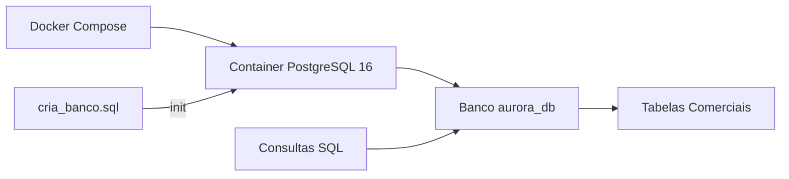

# Requisitos Técnicos — Rede Comercial Aurora

## Stack Tecnológica

| Componente | Tecnologia | Justificativa |
|-----------|-----------|---------------|
| SGBD | PostgreSQL 16 | Banco relacional robusto, gratuito, com excelente suporte a consultas analíticas |
| Container | Docker + Docker Compose | Permite reproduzir o ambiente de forma padronizada em qualquer máquina |
| Linguagem SQL | SQL padrão (PostgreSQL) | Linguagem nativa para consultas e manipulação de dados |

## Requisitos do Sistema

- **Docker Desktop** 4.x ou superior
- **Docker Compose** v2 (incluído no Docker Desktop)
- **Git** para versionamento e entrega
- ~500 MB de espaço em disco para o container PostgreSQL

## Arquitetura da Solução

O ambiente é composto por um único container Docker rodando PostgreSQL 16. Na primeira inicialização, o script `cria_banco.sql` é executado automaticamente, criando as tabelas e inserindo os dados de teste.

## Convenções de Nomenclatura

| Elemento | Convenção | Exemplo |
|----------|-----------|---------|
| Tabelas | snake_case, plural | `itens_venda` |
| Colunas | snake_case | `preco_unitario` |
| Chave primária | `<entidade>_id` | `produto_id` |
| Chave estrangeira | mesmo nome da PK referenciada | `filial_id` |
| Tipos monetários | `NUMERIC(10,2)` | — |
| Identificadores | `SERIAL` | — |

## Indicadores Obrigatórios

### 1. Faturamento Bruto
- **O que mede:** valor total vendido antes de descontos
- **Fórmula:** `SUM(quantidade * preco_unitario)` a partir de `itens_venda`

### 2. Desconto Total
- **O que mede:** valor total concedido em descontos
- **Fórmula:** `SUM(vendas.desconto) + SUM(itens_venda.desconto_item * quantidade)`

### 3. Receita Líquida
- **O que mede:** valor efetivo obtido após descontos
- **Fórmula:** `faturamento_bruto - desconto_total`

### 4. Custo Total
- **O que mede:** custo dos produtos vendidos
- **Fórmula:** `SUM(quantidade * produtos.custo_unitario)`

### 5. Margem Bruta
- **O que mede:** resultado financeiro antes de despesas operacionais
- **Fórmula:** `receita_liquida - custo_total`

### 6. Margem Bruta Percentual
- **O que mede:** percentual de margem sobre a receita líquida
- **Fórmula:** `(margem_bruta / receita_liquida) * 100`

### 7. Quantidade Vendida
- **O que mede:** volume de unidades vendidas
- **Fórmula:** `SUM(quantidade)` a partir de `itens_venda`

### 8. Ticket Médio
- **O que mede:** valor médio por venda
- **Fórmula:** `receita_liquida / COUNT(DISTINCT venda_id)`

## Filtros Obrigatórios

| Filtro | Descrição | Implementação |
|--------|-----------|---------------|
| Período | Filtrar por data, mês, trimestre ou ano | `WHERE data_venda BETWEEN ...` ou via `calendario` |
| Filial | Filtrar por filial específica | `WHERE filial_id = ...` |
| Produto | Filtrar por produto específico | `WHERE produto_id = ...` |
| Categoria | Filtrar por categoria de produto | `JOIN produtos ... WHERE categoria_id = ...` |
